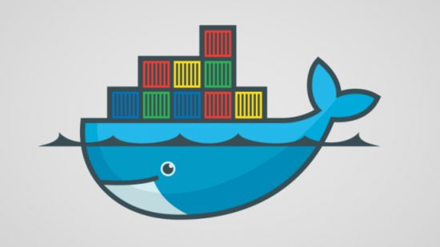
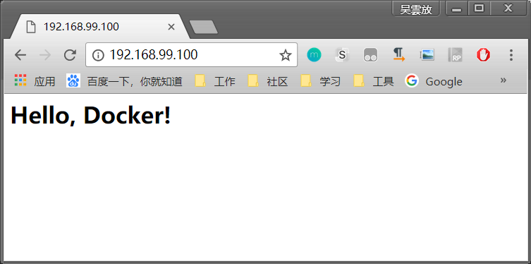

我们都知道，操作系统分为内核和用户空间。对于 Linux 而言，内核启动后，会挂载 root 文件系统为其提供用户空间支持。

而 Docker 镜像（Image），就相当于是一个 root 文件系统。比如官方镜像 ubuntu:16.04 就包含了完整的一套 Ubuntu 16.04 最小系统的 root 文件系统。

Docker 镜像是一个特殊的文件系统，除了提供容器运行时所需的程序、库、资源、配置等文件外，还包含了一些为运行时准备的一些配置参数（如匿名卷、环境变量、用户等）。镜像不包含任何动态数据，其内容在构建之后也不会被改变。



<!--more-->

#### 理解镜像构成
镜像是容器的基础，每次执行 docker run 的时候都会指定以哪个镜像作为容器运行的基础。

镜像是多层存储，每一层是在前一层的基础上进行的修改；而容器同样也是多层存储，是在以镜像为基础层，在其基础上加一层作为容器运行时的存储层。

现在让我们以定制一个 Web 服务器为例子，来讲解镜像是如何构建的。
```
docker run --name webserver -d -p 80:80 nginx
```

这条命令会用 nginx 镜像启动一个容器，该容器命名为 webserver，并且映射了宿主机的 80 端口，这样我们就可以在宿主机用浏览器去访问这个 nginx 服务器。
docker的启动画面中有当前容器的 ip，例如：192.168.99.100，打开浏览器直接访问该 ip 就能看到默认的 Nginx 欢迎页面。

现在，我们来做点尝试，修改下nginx的欢迎页面。
```
$ docker exec -it webserver bash
root@bcd5b7c85e68:/# echo '<h1>Hello, Docker!</h1>' > /usr/share/nginx/html/index.html
root@bcd5b7c85e68:/# exit
exit
```

我们以交互式终端方式进入 webserver 容器，并执行了 bash 命令，也就是获得一个可操作的 Shell。

然后，我们用 Hello, Docker! 覆盖了 /usr/share/nginx/html/index.html 的内容。

现在我们再刷新浏览器的话，会发现内容被改变了。


我们修改了容器的文件，也就是改动了容器的存储层。要保存这些修改，可以使用 docker 提供的 docker commit 命令将存储层保存下来成为新的镜像。也就是说，是在原有镜像的基础上，再叠加上改动了的存储层并构成新的镜像。

这意味着每一次修改都会让存储层叠加，而且你所删除的上一层的东西并不会丢失，会一直如影随形的跟着这个镜像，即使根本无法访问到。

想想就是件很恐怖的事情。😰

不过，存在即是真理，commit 虽然恐怖，但还是很有用武之地的，比如被入侵后保存现场和一些特殊场合。

#### 使用 Dockerfile 定制镜像
如果我们可以把每一层修改、安装、构建、操作的命令都写入一个脚本，用这个脚本来构建和定制镜像，那么之前提及透明性和体积臃肿的问题就都会解决。

这个脚本就是 Dockerfile。

Dockerfile 是一个文本文件，其内包含了一条条的指令(Instruction)，每一条指令构建一层，因此每一条指令的内容，就是描述该层应当如何构建。

还是以上边的 nginx 为例。

创建一个文件夹，然后在文件夹内创建一个文本文件。
```
mkdir /c/docker
cd /c/docker
touch Dockerfile
```
其内容为：
```
FROM nginx
RUN echo '<h1>Hello, M-finder!</h1>' > /usr/share/nginx/html/index.html
```

##### FROM 指定基础镜像
所谓定制镜像，就是以一个镜像为基础，在其上进行定制。就像我们先运行了一个 nginx 镜像的容器，再进行修改一样，基础镜像是必须指定的。

FROM 就是指定基础镜像，因此一个 Dockerfile 中 FROM 是必备的指令，并且必须是第一条指令。

##### RUN 执行命令
RUN 指令是用来执行命令行命令的。由于命令行的强大能力，RUN 指令在定制镜像时是最常用的指令之一。其格式有两种：

shell 格式：RUN <命令>，就像直接在命令行中输入的命令一样。
刚才写的 Dockerfile 中的 RUN 指令就是这种格式。
```
RUN echo '<h1>Hello, Docker!</h1>' > /usr/share/nginx/html/index.html
```

run 命令应尽可能的压缩为一行，因为每一个 run 命令就是一层存储层，而且，命令应该遵循良好的代码格式，比如换行、缩进、注释等，会让维护、排障更为容易,最后也应该添加清理工作的命令。

##### 构建镜像
在 Dockerfile 文件所在目录执行：
```
$ docker build -t nginx:v3 .
Sending build context to Docker daemon   2.56kB
Step 1/2 : FROM nginx
 ---> c5c4e8fa2cf7
Step 2/2 : RUN echo '<h1>Hello, Docker!</h1>' > /usr/share/nginx/html/index.html
 ---> Running in 4e2f0f98fbfe
Removing intermediate container 4e2f0f98fbfe
 ---> 8b70819a7261
Successfully built 8b70819a7261
Successfully tagged nginx:v3
SECURITY WARNING: You are building a Docker image from Windows against a non-Windows Docker host. All files and directories added to build context will have '-rwxr-xr-x' permissions. It is recommended to double check and reset permissions for sensitive files and directories.
```

从命令的输出结果中，我们可以清晰的看到镜像的构建过程。在 Step 2 中，如同我们之前所说的那样，RUN 指令启动了一个容器 4e2f0f98fbfe，执行了所要求的命令，并最后提交了这一层 c5c4e8fa2cf7，随后删除了所用到的这个容器 4e2f0f98fbfe。

这里我们使用了 docker build 命令进行镜像构建。其格式为：

docker build [选项] <上下文路径/URL/->
在这里我们指定了最终镜像的名称 -t nginx:v3，构建成功后，我们可以像之前运行 nginx 那样来运行这个镜像。


