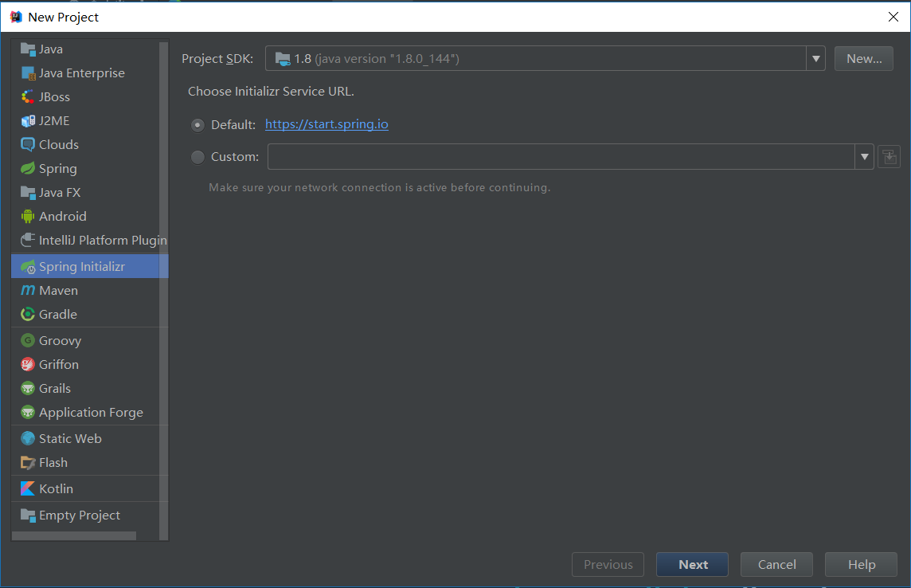
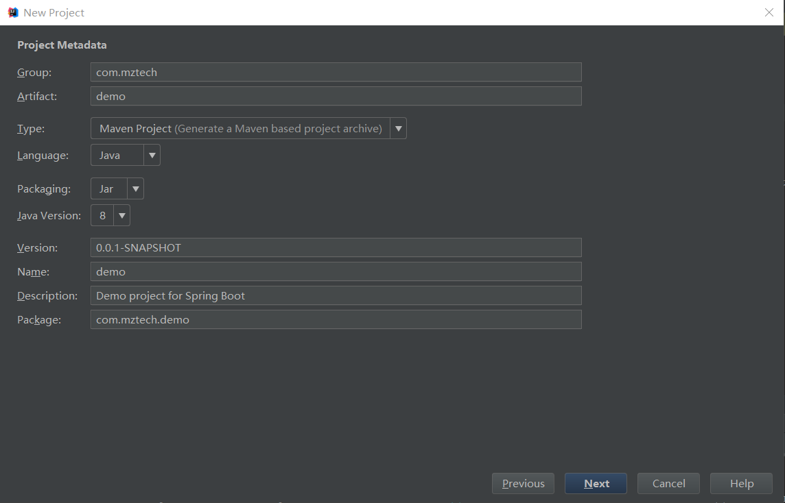
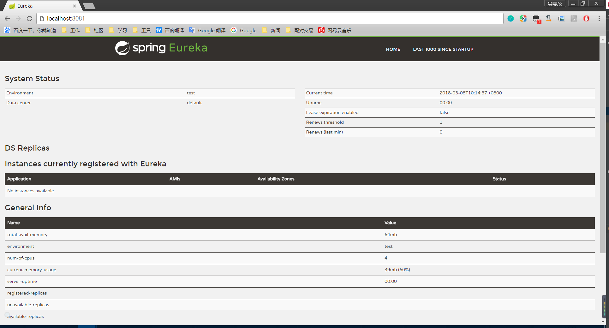

#### 前言
我领导，亮哥，昨天让我们看下微服务架构，接下来准备把手里的项目整合下。
推荐给我们的有 Spring Cloud 和 Dubbo。考虑到 Dubbo 有突然停止维护的前科，还是选用前者吧。
就这样，跟 Spring Cloud 开始了第一次握手。

<!--more-->
#### 初次见面
初次见面，先介绍一下：
>Spring Cloud是一系列框架的有序集合。它利用Spring Boot的开发便利性巧妙地简化了分布式系统基础设施的开发，如服务发现注册、配置中心、消息总线、负载均衡、断路器、数据监控等，都可以用Spring Boot的开发风格做到一键启动和部署。
Spring并没有重复制造轮子，它只是将目前各家公司开发的比较成熟、经得起实际考验的服务框架组合起来，通过Spring Boot风格进行再封装屏蔽掉了复杂的配置和实现原理，最终给开发者留出了一套简单易懂、易部署和易维护的分布式系统开发工具包。

Spring 是一个全面、模块化的设计层面框架，Spring Boot 是 Spring 的一套快速配置脚手架，简化了基于 Spring 的应用开发，而 Spring Cloud 利用 Spring Boot 的开发便利性巧妙地简化了分布式系统基础设施的开发，是一系列框架的有序集合。

Spring Cloud大礼包包含很多组件，Spring Cloud Eureka 是 Spring Cloud Netflix 微服务套件中的一部分，它基于Netflix Eureka 做了二次封装，主要负责完成微服务架构中的服务治理功能。
相当于大管家，主管各项服务的注册与发现，这里先拿它下刀子好了。

#### 项目搭建
```
编辑器：IDEA
Spring Cloud版本：Finchley M7 （版本号以伦敦的地铁站命名）
```

##### 新建项目：
file->new project->srping initializr


##### 填写项目信息：
```
Group: com.mztech #自定义包名
Artifact: demo #项目名
```


##### 选择服务：
Cloud Discovery->Eureka Server

next->finish，创建完成

然后在src\main\resources\application.properties中添加配置信息：
```
spring.application.name=eureka-server
server.port=8081
#设置hostname
eureka.instance.hostname=localhost

#防止注册中心自我注册
eureka.client.register-with-eureka=false
eureka.client.fetch-registry=false

#注册地址
eureka.client.serviceUrl.defaultZone=http://${eureka.instance.hostname}:8081/eureka/
```

##### 添加注解：
在src\main\java\com\mztech\test\TestApplication.java中添加注解: @EnableEurekaServer
```
@EnableEurekaServer
@SpringBootApplication
public class TestApplication {

    public static void main(String[] args) {
        SpringApplication.run(TestApplication.class, args);
    }
}
```
##### 运行结果：
运行，然后浏览器访问:localhost:8081


##### 创建第一个服务：
新建一个项目，创建步骤同上，然后spring-cloud-client-test\src\main\java\com\mztech\client\ClientApplication.java的代码如下
```
@SpringBootApplication
@EnableEurekaClient
@RestController
public class ClientApplication {

    public static void main(String[] args) {
        SpringApplication.run(ClientApplication.class, args);
    }

    @Value("${server.port}")
    String port;

    @RequestMapping("/hi")
    public String home(@RequestParam String name) {
        return "hi " + name + ",i am from port:" + port;
    }
}
```

spring-cloud-client-test\src\main\resources\application.properties内容如下：
```
spring.application.name=Client-service
server.port=8082
eureka.instance.hostname=localhost
eureka.client.serviceUrl.defaultZone=http://${eureka.instance.hostname}:8081/eureka/
```
启动，刷新页面，可以看到服务已经被监听到了。


_<font color=red>* 注：</font>_

如果出现红字，说明是服务进入了自我保护模式。
查到信息说可以用 eureka.server.enable-self-preservation = false禁用自我保护模式，但是用了以后又智障一样出来一行红字提示我模式已关闭，好吧，你赢了。

##### 访问服务：
localhost:8082/hi?name=wu


#### 总结

坑不多，也不难。有点折腾，都是因为对java的熟悉度不高。