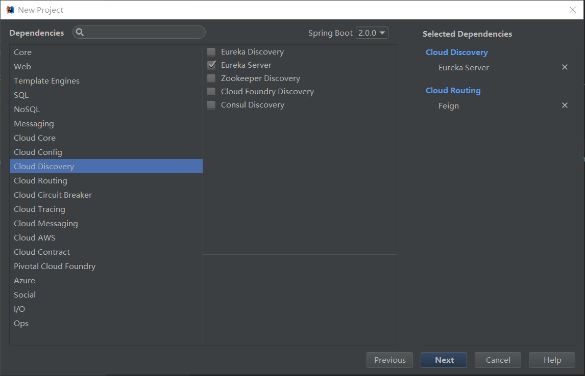
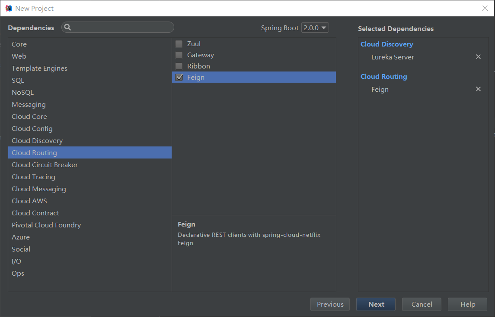

上一篇搞了服务的注册和发现，对Spring Cloud 也有了一定的了解，那么再来做下负载均衡 Ribbon 和 Feign。

这两个是两种形式的负载均衡的实现组件，二者选一即可，不过学习的话还是都看看，做下比较，也方便自己选择使用哪一个。
<!--more-->

## 第一章 Ribbon

#### 第一步
创建一个新的项目，过程同一，不过选择组件的时候需要勾选ribbon，不了解可以过去回顾下[点我查看](/2018/03/07/SpringCloud入门)

在spring-cloud-ribbon-test\src\main\java\com\mztech\ribbon\RibbonApplication.java中添加注解和方法
```
@SpringBootApplication
@EnableDiscoveryClient
public class RibbonApplication {

    public static void main(String[] args) {
        SpringApplication.run(RibbonApplication.class, args);
    }

    @Bean
    @LoadBalanced
    RestTemplate restTemplate() {
        return new RestTemplate();
    }
}
```

新建一个HelloService类，目录随意，然后内容如下：
```
@Service
public class HelloService {
    @Autowired
    RestTemplate restTemplate;

    public String hiService(String name) {
        return restTemplate.getForObject("http://Client-service/hi?name=" + name, String.class);
    }
}
```

再新建一个HelloController类：
```
@RestController
public class HelloControler {
    @Autowired
    HelloService helloService;

    @RequestMapping(value = "/hi")
    public String hi(@RequestParam String name) {
        return helloService.hiService(name);
    }
}
```
最后添加配置 spring-cloud-ribbon-test\src\main\resources\application.properties：
```
spring.application.name=Ribbon-service
server.port=8084
eureka.instance.hostname=localhost
eureka.client.serviceUrl.defaultZone=http://${eureka.instance.hostname}:8081/eureka/
```

#### 第二步
打开浏览器，访问配置中定义的端口，并传入参数name：http://localhost:8084/hi?name=wu


#### 第三步
复制一份代码，更改接口为8083，然后运行，继续刷新上边的url，就会看到其实是在两个端口上随机跳转。

## 第二章 Feign

#### 第一步
创建项目，步骤和之前一样，但是加选 feign组件，这里有个坑，添加依赖时名字和官网的是不一样的，如果手动添加，注解会添加不了，所以在创建时直接勾选组件可以省很多事情。
Ribbon组件的手动添加依赖一切正常，而这个组件开始遇到这种情况，所以补充说明一下。

还是截个图吧：



在spring-cloud-feign-test\src\main\java\com\mztech\feign\FeignApplication.java添加注解：
```
@SpringBootApplication
@EnableDiscoveryClient
@EnableFeignClients
public class FeignApplication {

    public static void main(String[] args) {
        SpringApplication.run(FeignApplication.class, args);
    }
}
```

创建FeignService接口类：
```
@FeignClient(value="Client-service")
@Service
public interface FeignService {
    @RequestMapping(value="/hi",method = RequestMethod.GET)
    String sayHiFromClient(@RequestParam(value = "name") String name);
}
```

再创建FeignController类：
```
@RestController
public class FeignController {
    @Autowired
    FeignService feignService;
    @RequestMapping(value ="/hi",method = RequestMethod.GET)
    public String sayHi(@RequestParam String name){
        return feignService.sayHiFromClient(name);
    }
}
```

最后添加配置：
```
spring.application.name=Feign-service
server.port=8085
eureka.instance.hostname=localhost
eureka.client.serviceUrl.defaultZone=http://${eureka.instance.hostname}:8081/eureka/
```

#### 第二步
打开浏览器，访问 localhost:8085/hi?name=wu，刷新几下，就能看到端口在调皮的跳啊跳。

#### 第三章
没了，继续折腾下一个。
