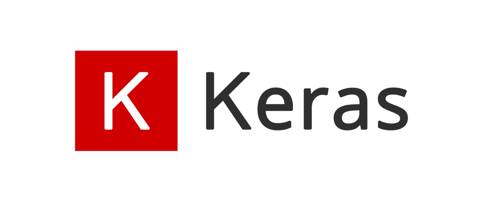
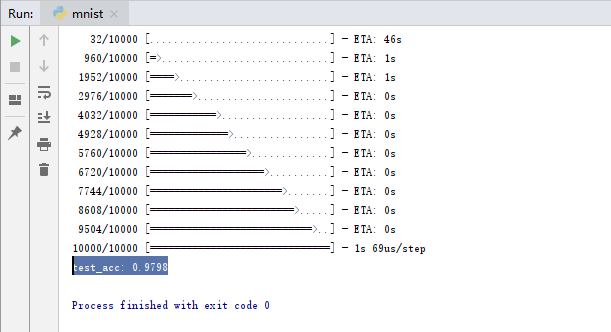

MNIST 是 keras 中一个入门级的计算机视觉数据集，这个数据集包含各种各样的手写数字图片，其中包含 60000 张训练图像和 10000 张测试图像。

是解决手写数字分类问题的经典数据集，可以看做是深度学习的 'Hello World'。


<!-- more -->


#### 下载数据
```python
from keras.datasets import mnist

(train_images, train_labels), (test_images, test_labels) = mnist.load_data()
```

这两行代码需要先运行，下载数据集。

下载过程会失败，多试几次，不需要翻墙。


`train_images` 和  `train_labels` 为训练集， 分别为图片数据和标签数据。模型将从这些数据中进行学习。

然后在测试集： `test_images` 和 `test_labels` 上对模型进行测试。

#### 构建网络

```python
from keras import models
from keras import layers
network = models.Sequential()
network.add(layers.Dense(512, activation='relu', input_shape=(28 * 28,)))
network.add(layers.Dense(10, activation='softmax'))
```

神经网络的核心组件是层（layer），它是一种数据处理模块，可以将它看成数据过滤器。
大多数深度学习都是将简单的层链接起来，从而实现渐进式的数据蒸馏（data distillation）。深度学习模型就像是数据处理的筛子，包含一系列越来越精细的数据过滤器（即层）。


#### 编译

```python
network.compile(optimizer='rmsprop',
                loss='categorical_crossentropy',
                metrics=['accuracy'])
```

loss: 损失函数，网络如何衡量在训练数据上的性能，即网络如何朝着正确的方向前进。
optimizer: 优化器，基于训练数据和损失函数来更新网络的机制
metrucs: 监控指标，本例只关心精度，即正确分类的图像所占的比例。

#### 准备图像数据
```python
train_images = train_images.reshape((60000, 28 * 28))
train_images = train_images.astype('float32') / 255
test_images = test_images.reshape((10000, 28 * 28))
test_images = test_images.astype('float32') / 255
```

开始之前，我们需要转换数据格式，让网络能够处理。
训练图像保存在一个uint8类型的数组中，其形状为 (60000, 28, 28)，取值区间为 [0, 255]。我们需要将其转换成一个 float32数组，形状为 (60000, 28 * 28)，取值范围为 0 ~ 1。


#### 准备标签
```python
from keras.utils import to_categorical
train_labels = to_categorical(train_labels)
test_labels = to_categorical(test_labels)
```

#### 开始训练
```python
network.fit(train_images, train_labels, epochs=5, batch_size=128)
```


#### 测试数据
```python
test_loss, test_acc = network.evaluate(test_images, test_labels)
print('test_acc:', test_acc)
```



测试集精度为97.98%，比训练集精度低不少。

训练精度和测试精度之间的这种差距是过拟合（overfit）造成的。

这些东西接下来再继续学习。


