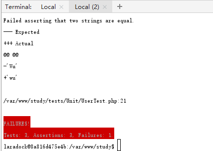
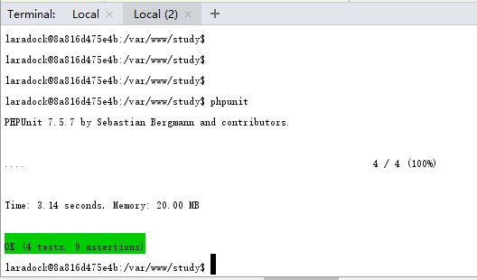

学习下 larave 内置的测试模块。

>当你想把一些东西写到 print 语句或者调试表达式中时，别这么做，将其写成一个测试来代替。
>        --Martin Fowler


<!-- more -->

最开始看到的关于 laravel 测试的信息是借助模型工厂来生成测试数据，今天查完资料发现，这只是测试中的一小部分。

laravel 内置了 PHPUnit 来做测试，并且已经做好了配置文件，还提供了一些便利的辅助函数，可以更直观的测试程序。

在 laravel 的项目中，包含一个 tests 目录，这个目录又有两个子目录：`Feature` 和 `Unit` 分别用来做功能测试和单元测试。


功能测试用于测试较大区块的代码，包括若干组件之间的交互，甚至一个完整的 HTTP 请求。

单元测试用于小的 、相互隔离的代码。

#### 配置
可以使用默认的配置，也可以创建一个 `.env.testing` 文件，在运行测试或执行带有    `--env=testing` 开关的 Artisan 命令时覆盖 `.env` 文件中的环境变量。

#### 创建 & 运行测试

运行 artisan 生成测试用例：
```php
// 在 Feature 目录下创建测试类
php artisan make:test UserTest

// 在 Unit 目录下创建测试类
php artisan make:test UserTest --unit
```

先生成一个单元测试，然后改造一下：
```php
$user = DB::table('users')->where('id',1)->first();
$name = $user->name;
$username = ucfirst($user->name);
$this->assertEquals($username, $name);
```

把用户名首s字母大写，然后判断和原用户名是否相等。

运行结果如下：




#### HTTP测试
新建一个路由和方法：
```php
Route::get('/user-info/{id?}', 'HomeController@userInfo');

public function userInfo(){
    $id = request('id');
    $user = User::where('id', $id)->first();
    return $user;
}
```

###### 新建测试
```php
php artisan make:test HttpStatusTest

$user = DB::table('users')->where('id',1)->first();
$username = ucfirst($user->name);

$response = $this->get('/user-info/1');

$response->assertStatus(200)
->assertJson([
    'id' => 1,
    'name'=> 'wu',
    'email'=> 'yf-wu@qq.com',
    'email_verified_at'=>null,
    'created_at'=> '2019-04-09 07:36:52',
    'updated_at'=> '2019-04-09 07:36:52'
]);
```

###### 运行测试
发现接口需要登录，所以会被拦截：


所以需要先模拟用户登录，可以使用：`Auth::loginUsingId(1);` 使 id 为 1 的用户强制登录。

再次运行，结果 ok。




#### 数据库测试
数据库测试功能点更多，可以验证表中是否存在某条数据，也可以用来生成测试数据等。

```php
$this->assertDatabaseHas('users', [
    'email' => 'sally@example.com'
]);
```

也可以使用 `assertDatabaseMissing` 帮助程序断言数据库中不存在数据。


###### 生成模型工厂
运行命令生成模型工厂：
```php
php artisan make:factory PostFactory
```

在项目的 `database\factories` 目录中，已经预先生成了一个 `UserFactory`:
```php
$factory->define(User::class, function (Faker $faker) {
    return [
        'name' => $faker->name,
        'email' => $faker->unique()->safeEmail,
        'email_verified_at' => now(),
        'password' => '$2y$10$92IXUNpkjO0rOQ5byMi.Ye4oKoEa3Ro9llC/.og/at2.uheWG/igi', // password
        'remember_token' => Str::random(10),
    ];
});
```

改造之前的 `TestUser` 来测试一下：

```php
public function testExample() {
    $user = factory(User::class)->create(['email' => 'm@m-finder.com']);
    $this->assertDatabaseHas('users', [
        'email' => 'm@m-finder.com'
    ]);
}
```

状态ok。


更多操作还是要参考: [ [ PHPUnit ] ](http://www.phpunit.cn)