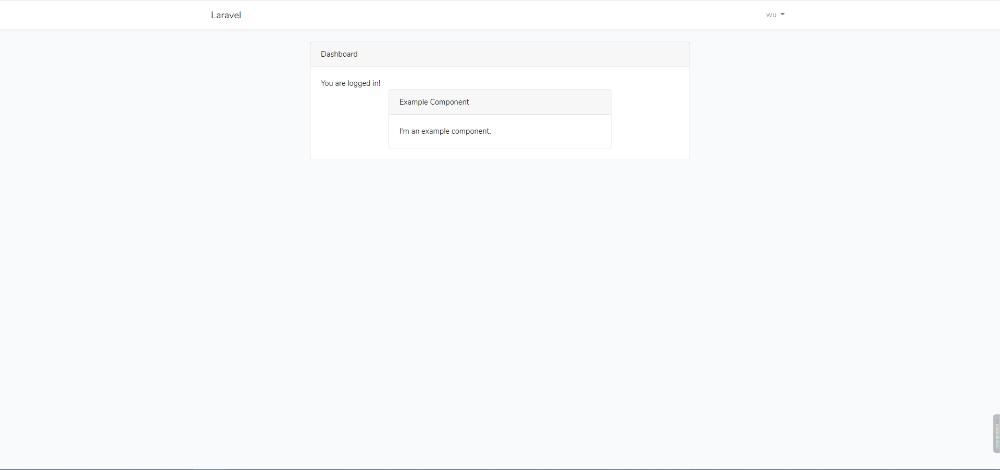

从 5.3 版本开始，用 Vue.js 作为默认 JavaScript 前端框架。

从刚接触 laravel 到现在已经又过去了四个版本，种种原因，还是一直没能用上 vue.js 来做开发，现在刚好因为公司项目用到了 vue，对 vue 有了一定的了解，所以顺便就研究下 vue 在 laravel 中的使用吧。


<!--more-->

#### 安装laravel

操作均在 laradock 的环境中进行。
进入 workspace 容器，执行以下命令安装 laravel
```
composer create-project laravel/laravel study
```

#### 配置mysql

docker-compose up -d nginx mysql phpmyadmin 启动容器
配置 nginx、hosts 并重启 nginx
进入 mysql 容器执行以下命令：
```shell
mysql -uroot -p
root
ALTER USER root IDENTIFIED WITH mysql_native_password BY 'PASSWORD';
exit;
exit

```

访问 phpmyadmin： localhost:8080，host 填写 mysql，用户名密码均为 root。

#### 配置laravel
修改数据库信息，生成用户模块并安装前端脚手架:
```php
php artisan make:auth
php artisan migrate
php artisan make:seed UsersTableSeeder

在 run 方法中添加用户信息：
$user = new App\User;
$user->name = 'wu';
$user->email = 'yf-wu@qq.com';
$user->password = Hash::make('111111');
$user->save();

再去 DatabaseSeeder 中打开 run 中的注释，接着往下执行：
php artisan db:seed
npm install
```

#### 修改视图 
home.blade.php：
vue 的组件在 resources/js/components，然后在 app.js 中注册。
```html
You are logged in!
<example-component></example-component>
```
更新脚手架：npm run dev  or npm run watch



#### 再实验下
例子来自：[[ cxp1539 ]](https://learnku.com/docs/laravel-core-concept/5.5/Laravel%E4%B8%8E%E5%89%8D%E7%AB%AF%E6%9C%80%E4%BD%B3%E5%AE%9E%E8%B7%B5/3029)

视图组件：
```vue
<template>
  <transition name="fade">
    <div v-if="isShow" class="goTop" @click="goTop">
      <span class="glyphicon glyphicon-menu-up"></span>
    </div>
  </transition>
</template>

<script>
export default {
  data() {
    return {
      isShow: false
    }
  },
  mounted() {
    const that = this
    $(window).scroll(function() {
      if ($(this).scrollTop() > 50) {
        that.isShow = true
      } else {
        that.isShow = false
      }
    })
  },
  methods: {
    goTop() {
      $('html,body').animate({ scrollTop: 0 })
    }
  }
}
</script>
<style scoped lang="scss">
  .fade-enter-active, .fade-leave-active {
    transition: opacity .5s;
  }
  .fade-enter, .fade-leave-to {
    opacity: 0;
  }
  .goTop {
    position: fixed;
    right: 36px;
    bottom: 50px;
    background: #FFF;
    width: 50px;
    height: 50px;
    line-height: 60px;
    text-align: center;
    border-radius: 2px;
    box-shadow: 0 4px 12px 0 rgba(7,17,27,.1);
    cursor: pointer;
    z-index: 1000;
    span {
      font-size: 20px;
    }
  }
</style>
```

app.js 注册：
```
Vue.component('go-top', require('./components/GoTop.vue'));
```

在 app.blade.php 中引入组件：
```
<main class="py-4">
    @yield('content')
</main>
<go-top></go-top>
```

为了使页面更高，随便修改个样式使滚动条出现。


#### 注意事项
> 每次修改组件后都需要重新运行一次 npm run dev，也可以用 watch-poll 监听。

#### 进阶使用
到了上一步已经可以完成一些基础的操作了，实际上，刚才得操作还用到了一个叫做 laravel-mix 的东西，在 [ [ LearnKu ] ](https://learnku.com) (laravel-china 社区)社区的文档中是这么介绍的：

>Laravel Mix 提供了简洁且可读性高的 API ，用于使用几个常见的 CSS 和 JavaScript 预处理器为应用定义 Webpack 构建步骤。可以通过简单链式调用来定义资源的编译。

>Laravel Mix 是叠加于 webpack 上的一层干净的膜， 它让 webpack 百分之80的用例变得十分简单。

也就是说，laravel-mix 是用来简化 webpack 学习和开发成本的工具。

对于后端人员来说，前端东西真的太多太难，mix 可以让我们不需要关注 webpack 的配置，即可轻松的编译前端脚本。

之前因为没在框架中用过 vue，所以一直也没有接触到这个工具，现在看完发现，学习之路真的是永无止境… 😂

