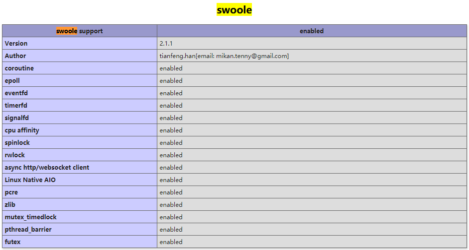

前前后后搭建过无数次环境，大大小小的坑也差不多都踩了，今天趁着腾讯搞活动，120块买了台16个月的服务器，想着晚上把环境搭建下吧，结果把之前的文档掏出来发现是没更新的，最新版在公司……

算了，老子再搞一遍，放在网上随便看。


<!--more-->

#### 更新组件
```
yum -y update

yum -y groupinstall 'Development Tools'

yum install gcc-c++ patch readline readline-devel zlib zlib-devel  bzip2 autoconf automake libtool bison iconv-devel libyaml-devel libffi-devel openssl-devel make   

yum -y install readline readline-devel ncurses-devel gdbm-devel glibc-devel tcl-devel openssl-devel curl-devel expat-devel db4-devel byacc sqlite-devel libyaml libyaml-devel libffi libffi-devel libxml2 libxml2-devel libxslt libxslt-devel libicu libicu-devel system-config-firewall-tui sudo wget crontabs logwatch logrotate perl-Time-HiRes git cmake libcom_err-devel.i686 libcom_err-devel.x86_64

yum install libxml2 libxml2-devel openssl openssl-devel bzip2 bzip2-devel libcurl libcurl-devel libjpeg libjpeg-devel libpng libpng-devel freetype freetype-devel gmp gmp-devel libmcrypt libmcrypt-devel readline readline-devel libxslt libxslt-devel libicu-devel openldap-devel
```

安装Pcre:
```
wget https://excellmedia.dl.sourceforge.net/project/pcre/pcre2/10.31/pcre2-10.31.tar.gz
tar -xf pcre2-10.31
cd pcre2-10.31
./configure
 make 
 make install
```

安装Libmcrypt：
```
wget https://nchc.dl.sourceforge.net/project/mcrypt/Libmcrypt/2.5.8/libmcrypt-2.5.8.tar.gz
tar -xf libmcrypt-2.5.8.tar.gz
cd libmcrypt-2.5.8
./configure
make 
make install
```

#### 安装php
嗯……最新版7.2开怼
```
wget http://cn2.php.net/get/php-7.2.3.tar.gz/from/this/mirror
tar -xf mirror
cd php-7.2.3
```

该编译了，好长…
```
./configure \
--prefix=/usr/local/php \
--with-config-file-path=/usr/local/php/etc \
--enable-fpm \
--with-fpm-user=nginx  \
--with-fpm-group=nginx \
--enable-inline-optimization \
--disable-debug \
--disable-rpath \
--enable-shared  \
--enable-soap \
--with-libxml-dir \
--with-xmlrpc \
--with-openssl \
--with-mcrypt \
--with-mhash \
--with-pcre-regex \
--with-sqlite3 \
--with-zlib \
--enable-bcmath \
--with-iconv \
--with-bz2 \
--enable-calendar \
--with-curl \
--with-cdb \
--enable-dom \
--enable-exif \
--enable-fileinfo \
--enable-filter \
--with-pcre-dir \
--enable-ftp \
--with-gd \
--with-openssl-dir \
--with-jpeg-dir \
--with-png-dir \
--with-zlib-dir  \
--with-freetype-dir \
--enable-gd-native-ttf \
--enable-gd-jis-conv \
--with-gettext \
--with-gmp \
--with-mhash \
--enable-json \
--enable-mbstring \
--enable-mbregex \
--enable-mbregex-backtrack \
--with-libmbfl \
--with-onig \
--enable-pdo \
--with-mysqli=mysqlnd \
--with-pdo-mysql=mysqlnd \
--with-zlib-dir \
--with-pdo-sqlite \
--with-readline \
--enable-session \
--enable-shmop \
--enable-simplexml \
--enable-sockets  \
--enable-sysvmsg \
--enable-sysvsem \
--enable-sysvshm \
--enable-wddx \
--with-libxml-dir \
--with-xsl \
--enable-zip \
--enable-mysqlnd-compression-support \
```

结束后make，make install，时间较长，耐心等待。

好了以后，复制一份ini文件备份，然后把php-fpm添加成service
```
cp php.ini-development /usr/local/php/etc/php.ini
cp sapi/fpm/init.d.php-fpm /etc/init.d/php-fpm
cp /usr/local/php/etc/php-fpm.d/www.conf.default www.conf
cp /usr/local/php/etc/www.conf.default www.conf
chmod +x /etc/init.d/php-fpm
service php-fpm start
```

添加php进环境变量：
```
vim /etc/profile 
PATH=$PATH:/usr/local/php/bin  
export PATH  
```

使修改生效：
```
source /etc/profile  
```

查看路径和php版本：
```
echo $PATH
php -v 
```

#### 安装nginx
安装nginx yum源
```
yum localinstall http://nginx.org/packages/centos/7/noarch/RPMS/nginx-release-centos-7-0.el7.ngx.noarch.rpm
```

然后安装nginx：
```
yum install nginx
```

然后，启动下试试？
```
service nginx start
```
访问http://你的ip/ 如果成功安装会出来nginx默认的欢迎界面

没成功就检查下端口是否可以访问 ,虚拟机可以直接干掉防火墙

#### 安装mysql
下载文件：
```
wget http://dev.mysql.com/get/mysql57-community-release-el7-8.noarch.rpm
```

开始安装：
```
rpm -ivh mysql57-community-release-el7-8.noarch.rpm
yum install mysql-community-server
```

这个比较快，装好开始运行：
```
systemctl start mysqld
```

加入开机自启：
```
systemctl enable mysqld 
```

查看默认密码：
```
grep 'temporary password' /var/log/mysqld.log

```

登陆修改密码：
```
[root@VM_34_176_centos ~]# mysql -u root -p
Enter password: 
Welcome to the MySQL monitor.  Commands end with ; or \g.
Your MySQL connection id is 2
Server version: 5.7.21

Copyright (c) 2000, 2018, Oracle and/or its affiliates. All rights reserved.

Oracle is a registered trademark of Oracle Corporation and/or its
affiliates. Other names may be trademarks of their respective
owners.

Type 'help;' or '\h' for help. Type '\c' to clear the current input statement.

mysql> SET PASSWORD FOR 'root'@'localhost' = PASSWORD('Xx..XXXX');
#密码不能太简单
Query OK, 0 rows affected, 1 warning (0.00 sec)

mysql> show databases;
+--------------------+
| Database           |
+--------------------+
| information_schema |
| mysql              |
| performance_schema |
| sys                |
+--------------------+
4 rows in set (0.00 sec)

mysql> exit;
Bye

```

#### 安装swoole

```
pecl install swoole
#添加到php.ini
cd /etc
vi php.ini
extension=swoole.so
```

_<font color=red>注：</font>_
安装好PHP后复制ini文件是因为编译时指定了 
```
--with-config-file-path=/usr/local/php/etc \
```
如果不复制的话也一样能够运行php，但是就无法装扩展了，踩坑千百遍终有一疏，装完swoole发现无法加载，最后查到时这里的问题。




打完收工，一个不小心又搞到凌晨一点，感觉头上凉凉哒~